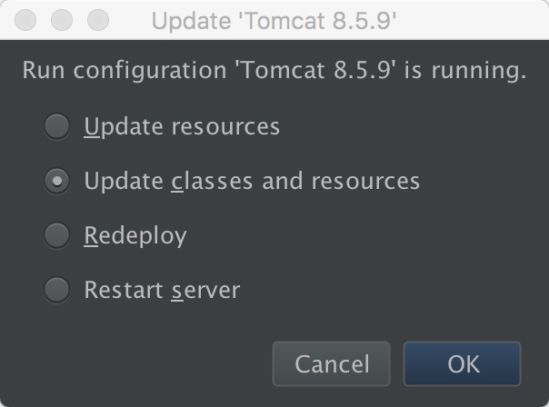

## JSP 
###出现的原因:
通过在 HTML 中嵌入一些**专有标签** 和 **脚本程序**实现网页中动态内容的显示.

###特点:
* 能够跨平台运行
* 将程序逻辑和页面显示分离
* 采用标签简化页面开发
* 组件可重用

###运行原理:
1. jsp 文件在第一次被访问时 ===> 编译成 servlet.java
2. servlet.java 被编译成 .class
3. servlet 容器(如 apache)将 servlet 实例化 ===> 加载到内存
4. web 后台程序开始运行.

----

##JSP 基本语法
* HTML 页面内容
* JSP 注释
* JSP 指令 ===> 用来提供编译信息:
    * page 指令 ===> 定义 jsp 页面的全局属性
    * include 指令 ===> 静态导入其他文件的数据
    * taglib 指令 ===> 引用标签库
* JSP 脚本元素(使用频率最多)
    * `<%! str = "ssthouse" %>` ===> 定义成员变量
    * `<%= (str + " is me")  %>` ===> 表达式, 作用就是输出数据给 HTML 显示
    * `<% java 代码 %>` ===> 直接可以编写 java 代码
* JSP 动作元素(简化多行java代码才能实现的效果)
    * `<jsp:include >` ===> 动态导入数据到 jsp 页面
    * `<jsp:forward>` ===> 跳转到新页面
    * `<jsp:param>` ===> 传递参数
    * `<jsp:useBean>` ===> 实例化 JavaBean
    * `<jsp:setProperty>` ===> 设置 JavaBean 属性
    * `<jsp:getProperty>` ===> 获取 JavaBean 属性


---

后面三个操作 JavaBean 属性的三个 action 例子为:
    
```html
    <%@ page contentType="text/html;charset=UTF-8" language="java" %>
<html>
<head>
    <title></title>
</head>
<body>
    
    <jsp:useBean id="userOne" class="com.ssthouse.bean.User" scope="session"/>
    <jsp:setProperty name="userOne" property="name" value="ssthouse_one"/>
    <jsp:setProperty name="userOne" property="age" value="21"/>
    
    <p>用户信息为:</p>
    <jsp:getProperty name="userOne" property="name"/>
    <jsp:getProperty name="userOne" property="age"/>

</body>
</html>
```
    
###Tips
    
1. 更新 java 代码后, 需要选择 **Redeploy**


   
   

    

    


