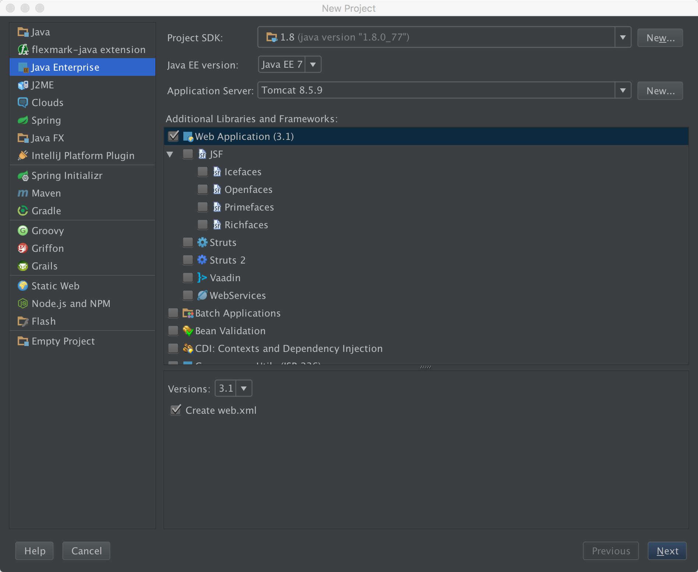

##目标: 使用 IDEA 开发 JAVA SSH 项目

首先尝试创建 Java Web project:

* 这里可以直接悬着 Application Server, 我们选着放在桌面的 apache tomcat, 后面应该是要改的...

 


##按照上面的样子, 貌似是可以跑起来的, 但是重新部署的时候会遇到一些问题, 后面再慢慢解决吧.


##MySQL 
 运行MySQL:
 1. Class.forName(), 使用反射加载驱动(需要自己去下载 jar 包).
 2. DriverManager 通过 URL 获取数据库连接(需要用户名, 密码, 开始 MySQL 服务).
 3. 通过 connection 获取 statement.
 4. 通过 statement 直接执行SQL 语句.
 
 ```java
public static void main(String[] args) {
   String mysqlURL = "jdbc:mysql://localhost/ssthouse";
   try {
       Class.forName("com.mysql.cj.jdbc.Driver");
       //获取数据库连接
       Connection connection = DriverManager.getConnection(mysqlURL, "root", "ssthouse");
       Statement statement = connection.createStatement();
       String sqlStr = "SELECT * FROM books";
       ResultSet resultSet = statement.executeQuery(sqlStr);
       while (resultSet.next()) {
           System.out.println(resultSet.getString("name"));
           System.out.println(resultSet.getString("author"));
           System.out.println(resultSet.getString("id"));
       }
   } catch (ClassNotFoundException | SQLException e) {
       e.printStackTrace();
   }
}
 ```

